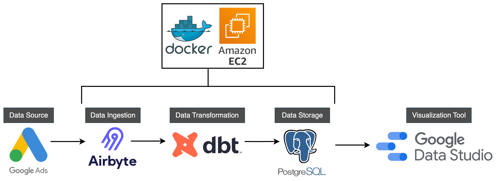

# Modern Data Stack - Batch Pipeline - Google Ads

## Project Overview:
1) **Architecture:**        The overall architecture used in this pipeline
2) **Problem Statement:**   The problem that is being solved using this pipeline
3) **Data Source:**         Google Ads is the data source for this project
4) **Data Ingestion:**      Airbyte is used as the data extraction/ingestion tool
5) **Data Transformation:** All data transformations were executed using dbt
6) **Data Storage:**        Postgres was used for data storage
7) **Visualization:**       Looker Studio was used to visualize data exports
8) **Future Iteration:**    Recommendations of optimizations and new features to be added in the pipeline

### 1) Architecture
Here is the Project Arhitecture

Utilized Docker Compose to deploy and manage Airbyte, dbt, and Postgres containers on an AWS EC2 instance

### 2) Problem Statement
The project encompasses main aspects of a batch data pipeline, with the goal of reducing manual data pulls from Google Ads report builder and automating the data views to be exported to Looker Studio on a set cadence for Campaign and Keyword analysis.

### 3) Data Source
Data is extracted using Airbyte from Google Ads API v18 (Airbyte version 3.7.1)

The views that were expected to be the final output of the data pipeline are as follows:

**Ad View:** This view is mainly comprised of these dimensions; Ad Name, Campaign Name, Ad Group and Status alongside key metrics such as Cost, Clicks etc. This is also shown in the next slide (Slide 12)

**Keyword View:** This view is mainly comprised of these dimensions; Keyword, Match Type, Campaign Name, Ad Group and Status alongside key metrics such as Cost, Clicks, Impressions, Interactions etc. This is also shown on Slide 13

#### Key Resources
* Google Ads v18 docs can be found [here](https://developers.google.com/google-ads/api/fields/v18/overview)
* [This](https://developers.google.com/google-ads/api/docs/query/cookbook#gaql_2) resource helps showcases API queries that return the same data as the default screens of the Google Ads UI

### 4) Data Ingestion
Data Ingestion was carried out using Airbyte hosted on AWS EC2 instance. The data transfers were scheduled to run using Airbyte's cronjob feature. Multiple connectors were setup for source and destination in Airbyte as shown below:
* Source Connector: To ingest data from Google Ads API, the default connector version 3.7.1 was used
* Destination Connector: To export raw data from the Google Ads connector to Postgres destination, connector version 2.2.1 was used

### 5) Data Transformation
dbt core was used to transform Google Ads raw data hosted on AWS EC2 instance.

For the ELT process a multi-layered data architecture is used, called "staging-intermediate-mart"

**Staging Layer:** Raw, minimally transformed data from source systems.  
**Intermediate Layer:** Heavily transformed data, preparing it for analytical use.  
**Mart Layer:** Final, business-facing data, ready for analysis and reporting.  

The **Mart Layer** will have the final Two Big Tables depicting the Keyword and Ad Views found in the UI of the Google Ads Reporting

For **Staging Layer** the following tables were used from the API:
1) ad_group_ad_legacy
2) ad_group_ad
3) ad_group
4) campaign
5) keyword_view
6) ad_group_criterion

For **Mart Layer** this is the final, business-facing data, ready for analysis and reporting layer.  
In this layer there are 3 sublayers:
1) **Ad View:** This has the Big Table depicting the Ad View in Google Ads website
2) **Keyword View:** This has the Big Table depicting the Keyword View in Google Ads website
3) **Incremental Model:** This is an incremental model for ad_group_ad_legacy table from source

### 6) Data Storage
Data Storage was carried out using Postgres hosted on AWS EC2 instance for source and transformed data.  
This is the setup of schemas in Postgres. The following schemas and their purpose is shown below:
* **airbyte_internal:** automatically created by airbyte
* **g_ads_ad_group_ad_legacy:** Google Ads raw source data for table called Ad Group Ad Legacy ingested by Airbyte is stored in this schema
* **g_ads_without_ad_group_ad_legacy:** All Google Ads raw source data for all tables except for Ad Group Ad Legacy ingested by Airbyte are stored in this schema  (see Section 5) Data Transformation/Staging Layer for list of tables)
* **gads_dev:** All output of dbt models are stored in this schema

### 7) Visualization

### 8) Future Iteration

## Following files are included in this repository:

### Files used:
* Airbyte: Code used to setup Airbyte on AWS EC2 Instance. This can be found [here](https://github.com/ShaheerKhan200/gads-modern-data-stack/tree/main/airbyte).

### Result:
* Name.pptx: Overview of the project. This can be found [here]().

## More details coming soon...
